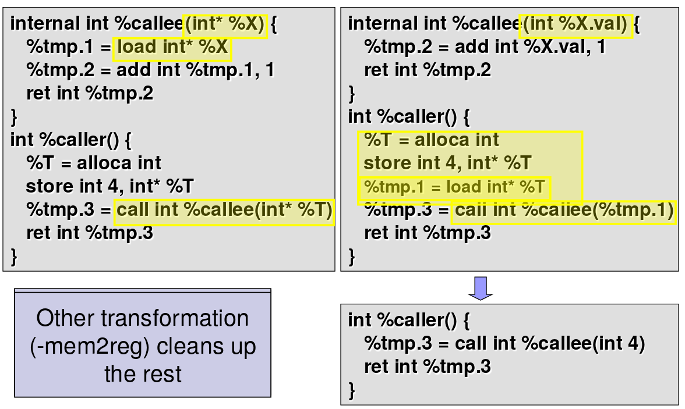

## LLVM

# LLVM IR
* Infinite number of registers - stack locations or SSA values
* Locals starts with %, globals with @

# LLVM Structure
Module contains Functions/Global Variables
Function contains BasicBlocks/Arguments and they are similar to c functions.
BasicBlock contains list of instructions - They end with a control flow instruction.
Instruction is opcode + vector of operands
All operands have types and instruction result is typed
IR is almost all doubly-linked lists.

Example of Transformation

https://www.cs.cmu.edu/afs/cs/academic/class/15745-s12/public/lectures/L3-LLVM-Part1.pdf page 19

# Instructions
* Subclassed to LoadInst, SmpInst, BranchInst etc. 
* Branches can occur only at end of basic blocks

# IR Types
* Integers, Floating Points
* Arrays [ #elements (>= 0) x element type ]
* Functions (returntype (paramlist))
* Pointers (type*, type addrspace(N)*)
* Vectors (<#elements (>0) x element type>)
* Structures ( { typelist })
* Types in LLVM IR are structural

There are preexisting struct, array, pointer types in llvm.

# Important Functions
* define_global
* function_type
* define_function
* var_arg_function_type - define_function name ty m creates a new function with name name and type ty in module m. If the named function already exists, it is renamed. An entry basic block is created in the function. See the constructor of llvm::GlobalVariable.
* append_block
* builder_at_end
* build_br
* block_terminator
* build_global_stringptr
* build_alloca

# Compile C to LLVM
clang -S -emit-llvm foo.c
clang -cc1 foo.c -emit-llvm